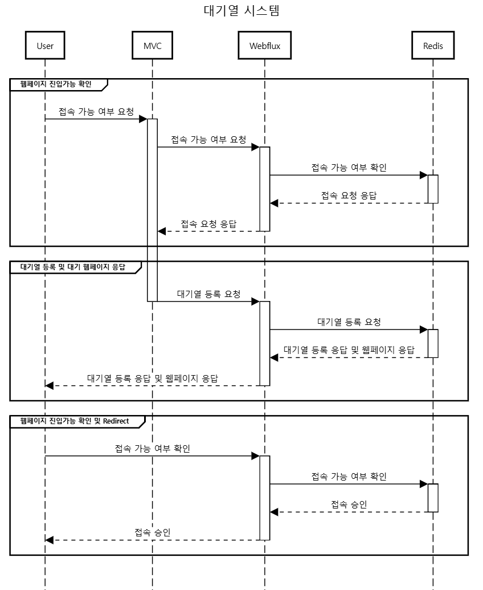

# 🚦 user-queue-system

**user-queue-system**은 고객의 서비스 접근을 효율적으로 관리하기 위한 **Java 기반 대기열(Queue) 시스템**입니다.  
다중 사용자 환경에서도 **공정한 순서(FIFO)**로 요청을 처리하도록 설계되었습니다.

---

## 📂 프로젝트 구조
```
user-queue-system/
├── gradle/ # Gradle 빌드 시스템 설정
├── src/
│ ├── main/java/ # 핵심 큐 관리 로직
│ └── test/java/ # 단위 테스트 코드
├── build.gradle # 프로젝트 빌드 설정
├── settings.gradle # 모듈 관리 설정
└── WaitingSystem.png # 시스템 시퀀스 다이어그램
```

---

## 🛠️ 기술 스택

| 범주        | 기술                          |
|-------------|-------------------------------|
| Backend     | Java, Spring Boot, Gradle, webflux     |
| Database    | Mysql, redis |


---

## ⚙️ 주요 기능

- ✅ FIFO(First-In-First-Out) 큐 처리
- ✅ 멀티스레드 환경 지원
- ✅ 대기열 상태 실시간 확인

---

## 📌시퀀스 다이어그램


---


⚠️ 참고 사항

⚠️ 이 프로젝트는 학습 및 구조 설계 목적의 예제입니다.
실 서비스 적용 시에는 인증, 보안, 장애 복구, 데이터 일관성 등을 추가로 고려해야 합니다.

실 운영 환경 적용 시 Redis, Kafka 등 외부 큐 시스템 연동 권장


